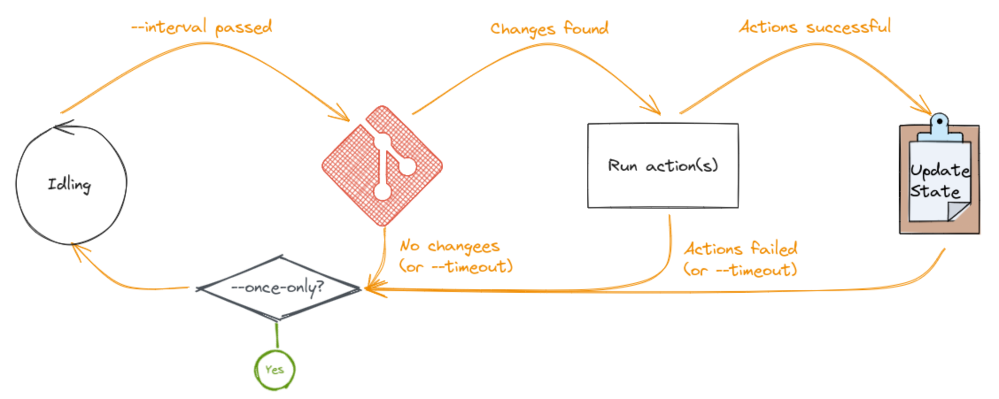

# kitops - generic GitOps agent

kitops monitors one or more Git repositories and performs arbitrary actions when those repositories are updated. It can be used by devops:y people to implement a wide variety of Continuous Delivery and Deployment scenarios and by systems and infra teams to provide GitOps-style workflows to the developers they support. [gitops.tech](https://www.gitops.tech/):

> GitOps is a way of implementing Continuous Deployment for cloud native applications. It focuses on a developer-centric experience when operating infrastructure, by using tools developers are already familiar with, including Git and Continuous Deployment tools. The core idea of GitOps is having a Git repository that always contains declarative descriptions of the infrastructure currently desired in the production environment and an automated process to make the production environment match the described state in the repository. If you want to deploy a new application or update an existing one, you only need to update the repository[.]

It turns out that this model can easily be applied to any configuration management task, by leveraging the fact that Git can be used to version any kind of text. kitops tries to fill this role.

**kitops is under development and not yet ready to be used.**

## Getting started

The simplest way to test kitops is to run the Docker image:

```shell
docker run --rm --name kitops bittrance/kitops \
    --url https://github.com/bittrance/kitops \
    --action 'echo "kitops was updated"'
```

For a full set of commandline options, try `--help`. If you want more advanced configuration (particularly if you wan to track multiple repositories), the [example.yaml](./example.yaml) configuration file explains how.

We also provide pre-built binaries for Linux, Windows and MacOS for scenarios where you want to run kitops on a virtual machine. You can download it from the [releases page](https://github.com/bittrance/kitops/releases).

## How does kitops work?

kitops is a statically compiled binary. It uses only pure Rust libraries and it therefore depends only on your platform's standard library (and an ssh binary where you want git+ssh support). It supports a wide variety of platforms and can be deployed in many different ways:

- as a long-running process on a VM
- as a periodic job
- as a long-running container
- as a CLI tool to perform a single run

kitops runs each task on a schedule:



kitops will retry the provided actions until they all succeed, thus providing a basis for eventual consistency. Actions given to kitops need to be idempotent (that is, safe to run multiple times). When kitops successfully executes all the actions of a task, it updates its state file. The state file acts as memory between executions so if kitops is run as a periodic job, you should point `--state-file` to persistent file storage.

kitops will clone repositories that are not already present in its `--repo-dir` so you can use ephemeral storage for this, but if your repositories are large, you may want to keep repositories on persistent storage too. This allows fetching only new changes, dramatically reducing network traffic.

## Configuration

### GitHub integration

To use kitops with private repositories on GitHub, you need to create a GitHub App and install it in the private repoisitories that you want kitops to track. You pass the App's ID with `--github-app-id` and the private key using `--github-private-key-file`. The app needs to have the `repo` scope. 

If you set `--github-status-context`, kitops will update the status of the commit that triggered the task. This requires the `repo:status` scope.

```shell
docker run --rm --name kitops bittrance/kitops \
    --url https://github.com/myorg/private-repo \
    --action ./deploy.sh \
    --github-app-id 12345 \
    --github-private-key-file /path/to/private-key.pem \
    --github-status-context deploy/production
```

## Rationale

### Why would you want to use kitops?

The traditional model is to have your pipelines (or actions or workflows) push deployments onto target environments.


This model has several potential weaknesses:

- The pipeline has to know where the result should be delivered and deployed
- When the number of target environments grow numerous, some may fail while others pass, making it hard to get a passing deploy
- It requires the pipeline (typically executing outside the target environment) to have extensive permissions
- Called APIs have to be accessible over the Internet (or require a VPN or similar)
- It is hard to delegate responsibility for the target environment to a third party

Instead, kitops enables the environment to "pull" deployments from a git repository.


This model:

- is scalable - only repository rate limiting caps the number of target environments
- adheres to the Principle of Least Privilege - the pipeline has no access to the environment and the environment only needs read access to the repository. This is particularly relevant in Azure, where granting permissions to a pipeline requires extensive AAD permissions, but creating a service principal for kitops can be delegated to developers via the `Application Developer` role.
- separates concerns - the actions taken on the repository content can be kept separate from the repository content itself
- is NAT-friendly - the environment only needs to be able to make outbound connections to the git server
- allows a third party to take responsibility for the target environment

## Alternatives

- [snare](https://tratt.net/laurie/src/snare/) - tool with similar design goals, but limited to GitHub webhooks (i.e. push-based).
- [GitHub Actions Runner](https://github.com/actions/runner) - the official runner application for GitHub Actions.

## Roadmap

The plan forward, roughly in falling priority:

- [x] --poll-once to check all repos that are due, then exit
- [ ] verify azdo support - Byron/gitoxide#1025
- [x] Reasonable timeout duration entry (i.e. not serde default secs/nanos)
- [x] Errors in scoped blocks should cancel, not wait for watchdog to reach deadline
- [x] allow configuring notification actions
- [x] proper options validation (e.g. config-file xor url/action)
- [x] specialized notification action to update github status
- [x] new git sha and branch name in action env vars
- [x] changed task config should override state loaded from disk
- [x] docker packaging
- [x] readme with design and deployment options
- [ ] release binaries for major platforms
- [ ] branch patterns allows a task to react to changes on many branches
- [ ] Support GitHub runner long polling interface
- [ ] intelligent gitconfig handling
- [ ] allow git commands in workdir (but note that this means two tasks can no longer point to the same repo without additional changeas)
- [ ] useful logging (log level, json)
- [ ] lock state so that many kitops instances can collaborate
- [ ] support Amazon S3 as state store
- [ ] support Azure Blob storage as state store
- [x] GitHub app for checking out private repo
